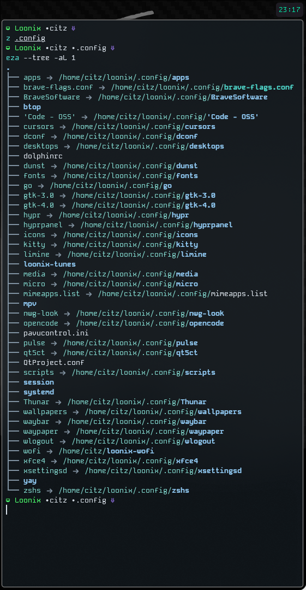

#  loonix-breadcrumb

> **The Creator Aesthetic** — Minimalist ZSH prompt with path-based breadcrumbs for the ultimate Linux ricing experience.

Built for **Loonix**, optimized for **Arch Linux**, **Kitty**, and **Zsh**.

---

##  Preview
` loonix  citz  loonix-wofi `

<p align="center">
  
</p>

##  Installation

Karena ini adalah bagian dari ekosistem **Loonix**, cara installnya gampang banget. Lo cuma perlu tempel (paste) script ini ke dalem file `.zshrc` lo.

1. Buka `.zshrc` pake `micro`:
   
   ```bash
   micro ~/.zshrc
   ```


2. Paste, lalu save
```bash
 # --- Prompt Setup (The Creator Aesthetic) ---

get_breadcrumb() {

local path_str="${PWD/#$HOME/%n% }"

local formatted="${path_str//\// }"

echo "${formatted}"

}


setopt prompt_subst

set_prompt() {

PROMPT="%F{#4dff71} %m %f%F{#D1DAE3}$(get_breadcrumb)%f %F{#7D63C4} %f

"

}

precmd_functions+=(set_prompt)


# Cursor Setup (Underline)

_set_cursor() { echo -ne "\e[4 q"; }

precmd_functions+=(_set_cursor)

_set_cursor
```

3. jangan lupa refresh config

```bash

source `/.zshrc

```

4. DONE !!


NOTE:
Dont Forget to install Kode Mono font & Symbol Nerd font & Twemoji font
Path Breadcrumbs
Loonix Colors: Green, White, Purple).
Auto-Cursor
